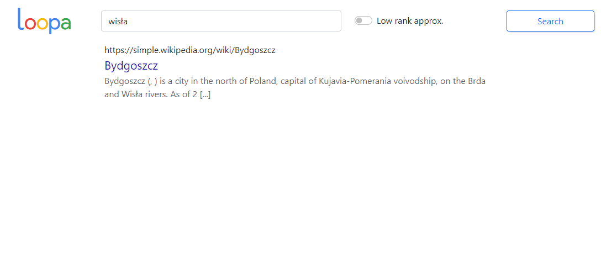
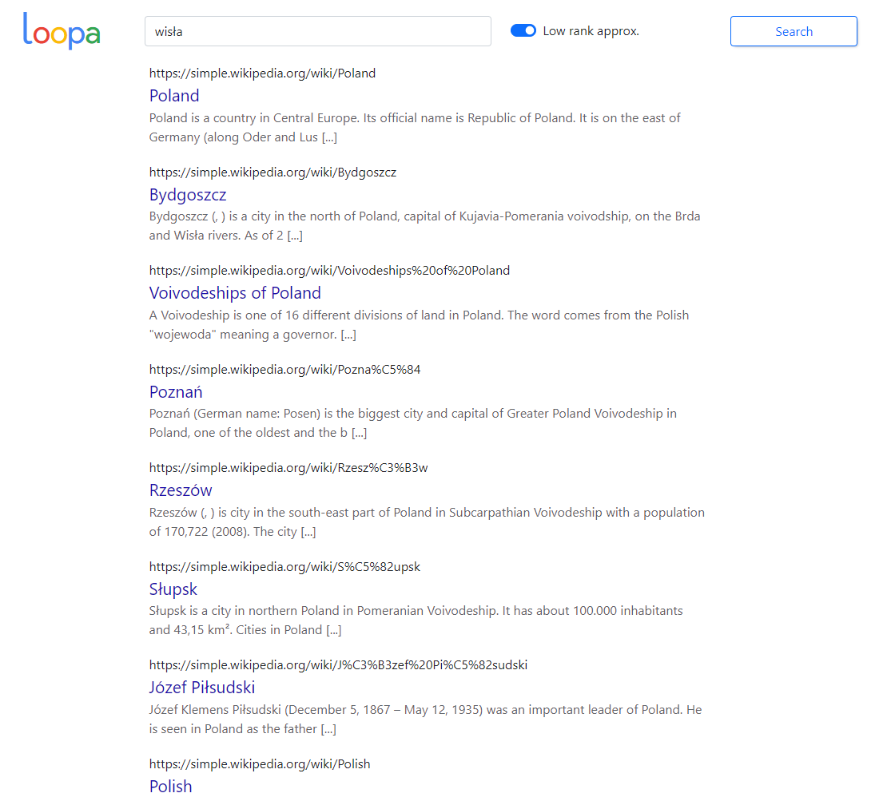
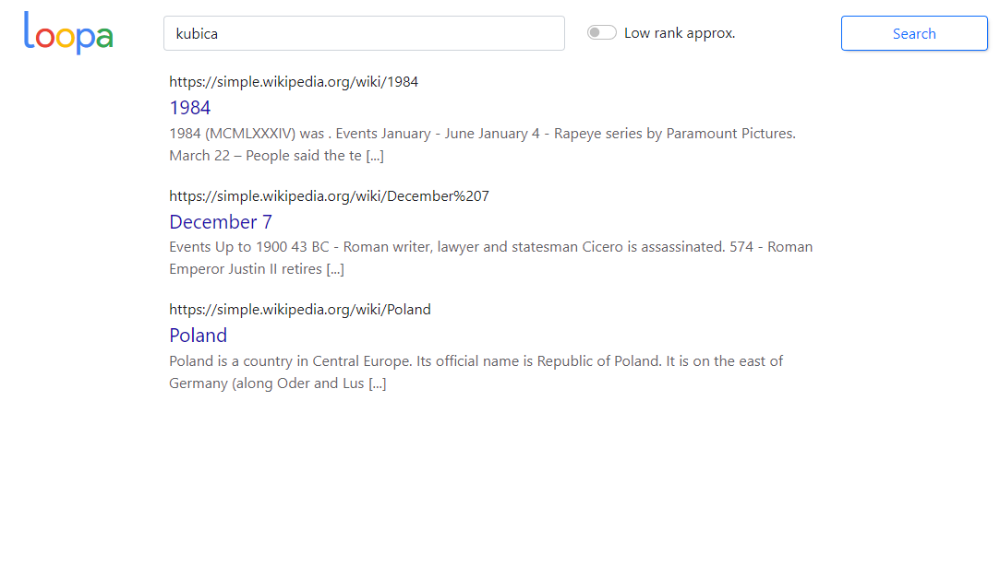
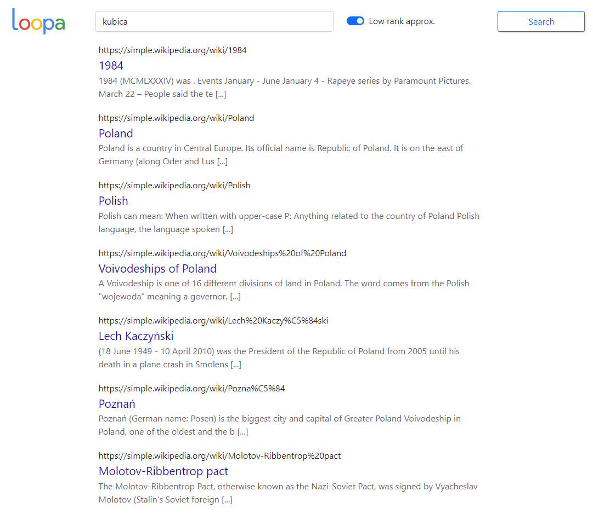
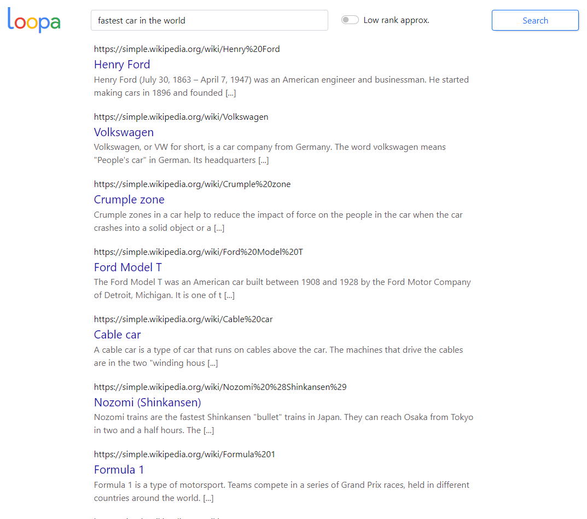
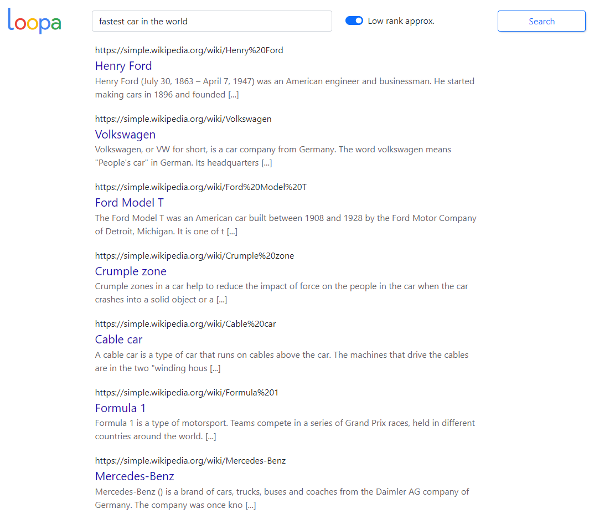

### Uruchomienie projektu (windows powershell, przetestowane i powinno działać):
```
python -m venv venv
Set-ExecutionPolicy Unrestricted -Scope Process
.\venv\Scripts\activate
pip install -r requirements.txt
flask run
```

### Uruchomienie projektu (linux):
```
python -m venv venv
source venv/bin/activate
pip install -r requirements.txt
export FLASK_APP=app
flask run
```

## Sprawozdanie

### Podstawowe informacje
 - Jako zbiór dokumentów, wykorzystany został zbiór artykułów z wikipedii w języku simple english.
 - Do wyznaczenia bag-of-words użyte zostały biblioteki:
   - re - wyrażenie regularne usuwające znaki niealfanumeryczne.
   - nltk - zamiana tekstu na tokeny, usunięcie stop words, sprowadzenie słów do rdzenia (Porter Stemmer).
   - unidecode - zamiana znaków unicode na znaki z ASCII.
 - Słownik termów został wyznaczony jako unia wszystkich słów występujących w tekstach.
 - Do reprezentacji term-by-document matrix jako macierzy rzadkiej użyta została biblioteka scipy.
 - Do zapisania obliczonych wcześniej danych na dysku wykorzystano narzędnie pickle.

### Działanie aplikacji
Przy domyślnych ustawieniach tworzone są 2 macierze. Pierwsza z nich obejmuje 150 tyś. artykułów z wikipedii oraz 500 tyś. termów.
Macierz ta jest generowana przy pierwszym uruchomieniu programu i następnie jest zapisywana w folderze data.
Druga macierz zawiera 5000 artykułów oraz 100 tyś. termów i również jest generowana tylko przy pierwszym uruchomieniu, ale w jej przypadku
przy każdym uruchomieniu aplikacji na jej podstawie tworzona jest przy użyciu SVD i low rank approximation macierz
A_k dla k = 500. Po uruchomieniu aplikacji interfejs graficzny jest dostępny pod adresem http://localhost:5000.

Uwaga: Czas pierwszego uruchomienia wynosi około 10 minut i może być jeszcze dłuższy na słabym komputerze.

### Przykłady działania dla 150 tyś. artykułów, bez low rank approximation


### Porównanie działania programu bez usuwania szumu i z usuwaniem szumu
Uwagi:
 - Do porównania wykorzystano zbiór danych 10 tyś. artykułów zarówno dla macierzy utworzonej z pomocą SVD i low rank approximation, jak i dla zwykłej macierzy term-by-document matrix.
 - W końcowej wersji aplikacji znajdują się zbiory danych innych rozmiarów, opisanych powyżej, ponieważ czas obliczania SVD oraz wykorzystywana przy tym pamięć, nie pozwalała na usunięcie szumu z macierzy dla 150 tyś. artykułów.

#### Przykład 1:



#### Przykład 2:



#### Przykład 3:



Wnioski:
 - W przypadku zapytań, dla których otrzymano mało wyników, po zastosowaniu low rank approximation, liczba otrzymanych wyników zwiększyła się i występują wśród nich artykuły, które nie zawierały wyszukiwanych słów, ale są w powien sposób z nimi powiązane. Najlepiej widać to dla zapytania 'wisła'. 
 - Dla zapytań, które miały dużo wyników bez low rank approximation, nie widać tak dużej różnicy w rezultatach.

### Wpływ IDF na wyniki wyszukiwania
Bez zastosowania IDF zapytania składające się z wielu wyrazów były wrażliwe na często występujące słowa. 
Przykładowo dla zapytania 'Robert Kubica' bez IDF na pierwszych miejscach były wyniki 'Roberts County', 'Julia Roberts', 'Robert Curthose', które zawierają tylko słowo 'robert'.
Po zastosowaniu IDF wzmocnione zostało znaczenie słów występujących rzadziej (w tym przypadku 'kubica') i 
dla tego zapytania pierwsze 2 wyniki to 'Robert Kubica' i 'BMW in Formula One'.


